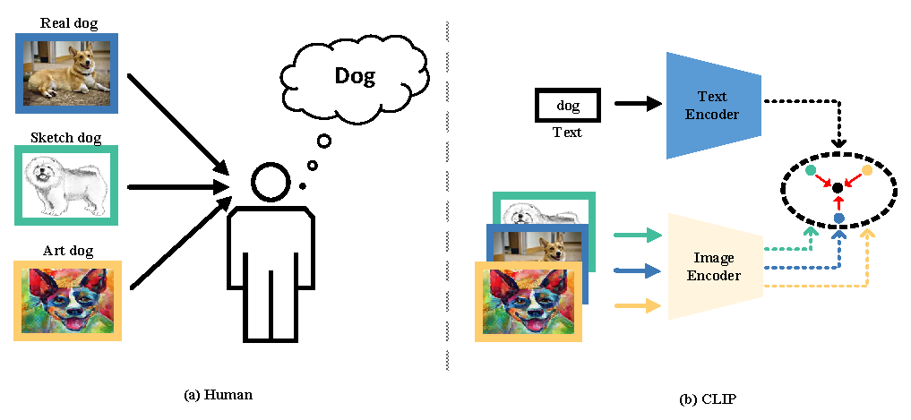

# Text Prompt for Domain Generalization on Image Classification

## Abstract
Most Domain generalization (DG) methods study how to learn domain-invariant representations that remain invariant across domains. It is common sense that the same words or text can describe images from different domains of the same category. Thus, the text representation can be viewed as a natural domain-invariant representation. Motivated by this, we investigate the potential of Contrastive Language-Image Pre-training models (CLIP) by introducing _Text Prompt_ in DG tasks, showing that the text representations generated by text prompts can yield decent generalization performance when being used as supervision for visual models, but remain considerable improvement potential. To reach its full potential, a detailed analysis of the representations identifies issues of domain bias and weak discriminability caused by CLIP representations. Further, we propose a simple yet efficient joint text-image loss to eliminate domain bias and improve the discriminability of task-relevant domain-invariant representations. Extensive experiments are conducted to verify the effectiveness of the proposed method, and the results show that the proposed approach can significantly outperform the existing state-of-the-art methods on five standard DG benchmarks.
<p align="center">
    
</p>

---

Note that this project is built upon [DomainBed@3fe9d7](https://github.com/facebookresearch/DomainBed/tree/3fe9d7bb4bc14777a42b3a9be8dd887e709ec414) and [SWAD](https://github.com/khanrc/swad).


## Preparation

### Dependencies

```sh
pip install -r requirements.txt
```

### Datasets

```sh
python -m domainbed.scripts.download --data_dir=/data/
```

### Environments

Environment details used for our study.

```
Python: 3.7.13
PyTorch: 1.12.0+cu113
Torchvision: 0.13.0+cu113
CUDA: 11.3
CUDNN: 8.2
NumPy: 1.21.5
PIL: 9.0.1
```

## How to Run

`train_all.py` script conducts multiple leave-one-out cross-validations for all target domain.

```sh
python train_all.py exp_name --dataset PACS --data_dir /data/
```

- PACS

```
CUDA_VISIBLE_DEVICES=0 python train_all.py PACS --dataset PACS --deterministic \
--trial_seed 0 --checkpoint_freq 100 --steps 5000 --data_dir $data_dir --algorithm Contrast \
--contrast_w 0.1 --lr 5e-5
```

- VLCS

```
CUDA_VISIBLE_DEVICES=0 python train_all.py VLCS --dataset VLCS --deterministic \
--trial_seed 0 --checkpoint_freq 200 --steps 5000 --data_dir $data_dir --algorithm Contrast \
--contrast_w 0.01 --lr 1e-6
```

- OfficeHome

```
CUDA_VISIBLE_DEVICES=0 python train_all.py OH --dataset OfficeHome --deterministic \
--trial_seed 0 --checkpoint_freq 200 --steps 5000 --data_dir $data_dir --algorithm Contrast \
--contrast_w 1 --lr 5e-5
```

- TerraIncognita

```
CUDA_VISIBLE_DEVICES=0 python train_all.py TR0 --dataset TerraIncognita --deterministic \
--trial_seed 0 --checkpoint_freq 200 --steps 5000 --data_dir $data_dir --algorithm Contrast \
--contrast_w 1 --lr 5e-5
```

- DomainNet

```
CUDA_VISIBLE_DEVICES=0 python train_all.py DomainNet --dataset DomainNet --deterministic \
--trial_seed 0 --checkpoint_freq 1000 --steps 15001 --data_dir $data_dir --algorithm Contrast \
--contrast_w 0.1 --lr 5e-5
```
